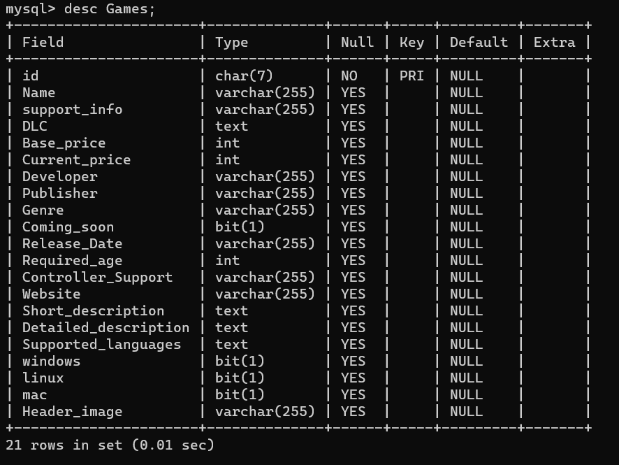
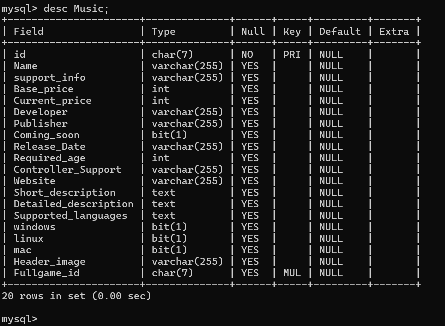
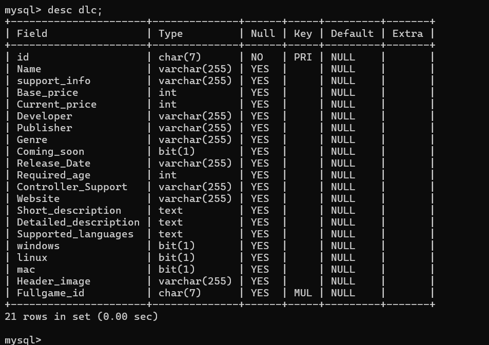
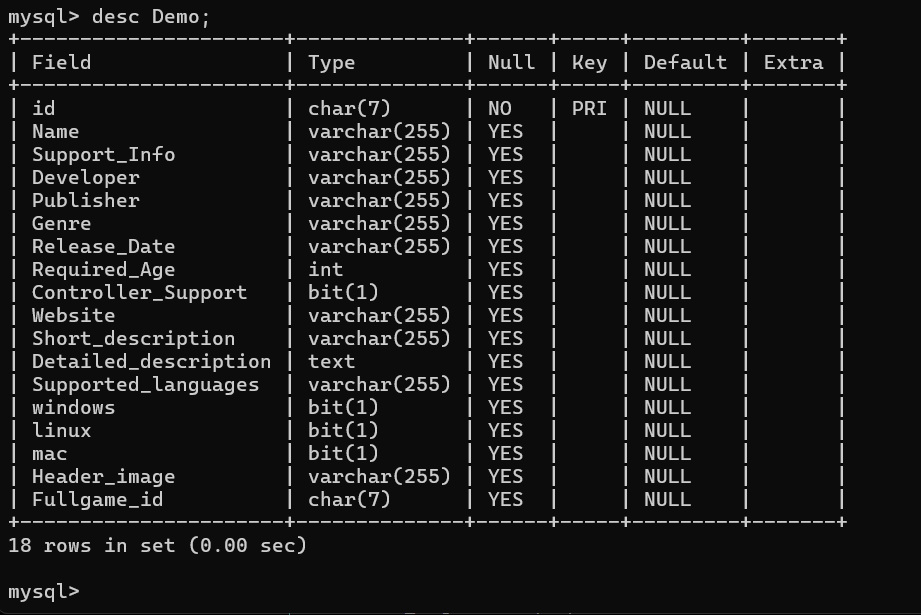
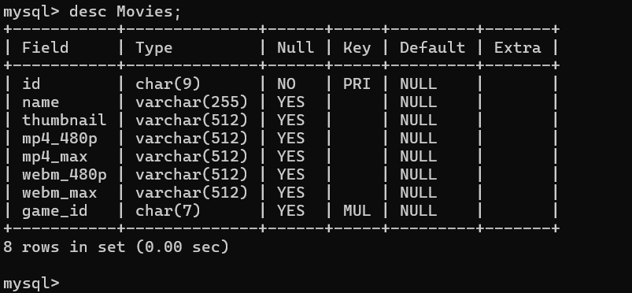

# Digi-Dynamics
**Name**: Steam Scout 


# Prereqs
- Python version: 3.12
- python-decouple==3.8
- Django==5.0.1
- beautifulsoup4==4.12.3
- python-steam-api==1.2.2
- mysql-connector-python==8.3.0
- mySQL: https://dev.mysql.com/downloads/file/?id=526407 

Install all prereqs (except mySQL, that needs to be done through the URL)

Install Individually
- Decouple
```
py -m pip install python-decouple
```

- Django
```
py -m pip install Django
```
- beutifulsoup4
```
py -m pip install beautifulsoup4
```

- python-steam-api
```
py -m pip install python-steam-api
```

- mysql-connector-python
```
py -m pip install mysql-connector-python
```

or 
**Install all of it with**
```
py -m pip install -r requirements.txt
```


NOTE: You are going to have to create 2 .env files in mysite/APICalls and mysite/database

mysite/APICalls/.env
```
STEAM_API_KEY= "<YOUR_API_KEY>"
```
Get this from <a href="https://steamcommunity.com/dev/apikey">https://steamcommunity.com/dev/apikey</a>


mysite/ReadGames/database/.env
```
uname = "<Your_Uname>"
pass = "<your_pass>"
database = "steam"
```

Note: uname will run the SQL through 'uname'@'localhost', I named my database "steam" 


# HOW TO RUN
<a href="https://docs.djangoproject.com/en/5.0/">https://docs.djangoproject.com/en/5.0/ </a>

1) change curr directory:

``` 
cd mysite 
```
2) Run django **(START HERE when you pull this code)**
  ```
  py manage.py runserver
  ```
  or 
  ```
  py -m manage runserver
  ```
4) Put this URL into the page:
  <a href = "http://127.0.0.1:8000/">http://127.0.0.1:8000/</a>

5) Note: if you need any help with finding a command, use
```
py manage.py --help
```
or 
```
py -m manage --help
```

Access admin webpage using <a href="http://127.0.0.1:8000/admin/">http://127.0.0.1:8000/admin/</a>


# Types from steam web API
<ul>
  <li>Game</li>
  <li>Music</li>
  <li>Demo</li>
  <li>DLC</li>
</ul>

# Database Tables
<b>Games</b>


<b>Music Schema</b>


<b>DLC Schema</b>


<b>Demo Schema</b>


<b>Movie Schema</b>



# Project Idea
- [x] Steam Game Search Engine


# credit
**Collaborators**:  
- Hunter Smith
- Alfred Newsome
- Isaac Watts
- Tamia